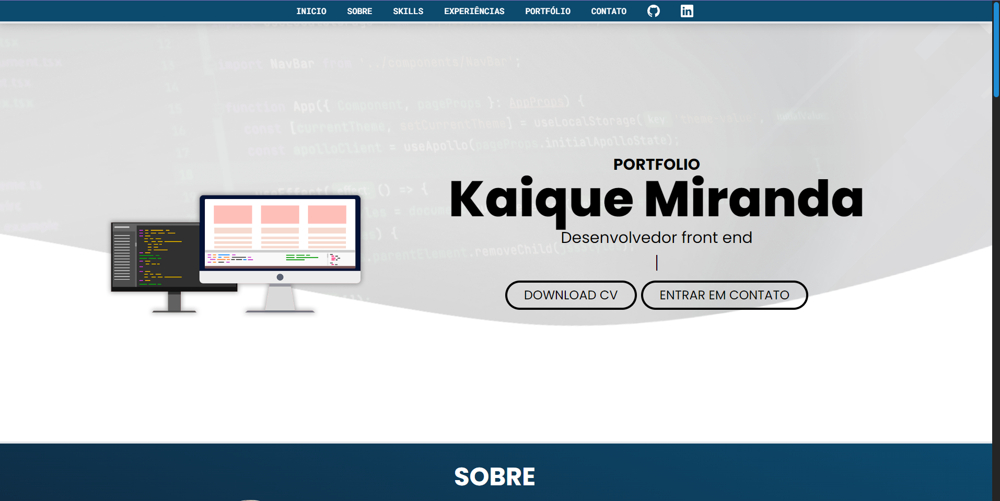
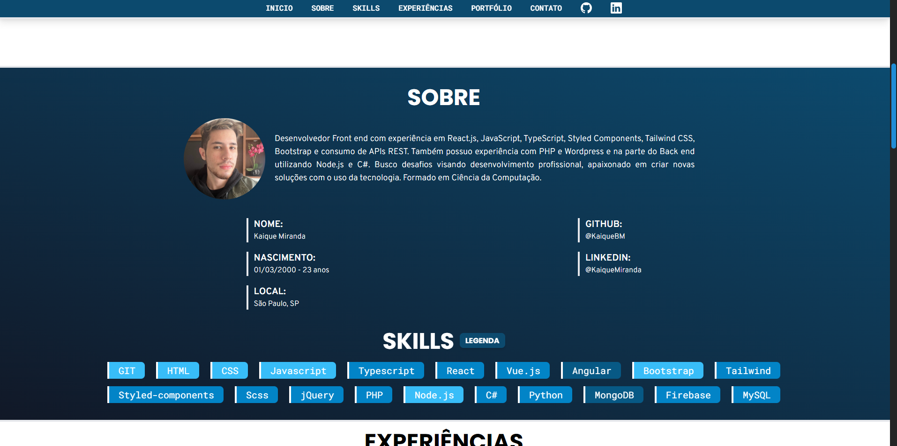
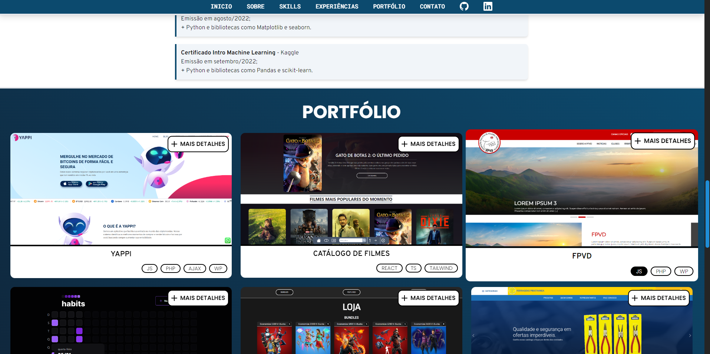
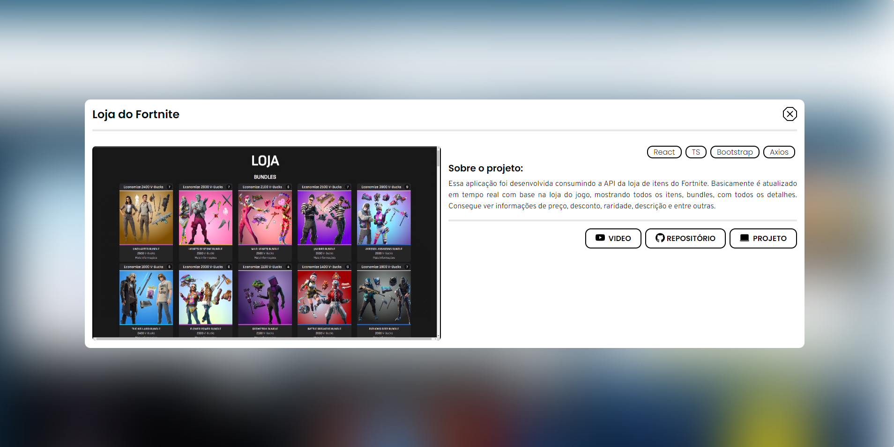

<h2 align="center">
  Portfolio
</h2>

<p align="center">
 <a href="#-sobre-o-projeto">Sobre</a> •
 <a href="#-tecnologias">Tecnologias</a> •
 <a href="#-aplicação">Aplicação</a> • 
 <a href="#-como-executar">Executar</a> 
</p>

## 💻 Sobre o projeto

Desenvolvi um portfolio para colocar alguns projetos que já fiz, além de informações como skills, experiências e contato. Foi feito em React utilizando Typescript e Tailwind. A aplicação vou subida no ar e pode ser acessado no seguinte link:
<a href="https://kaiquemirandadev.netlify.app/"><b>Kaique Miranda - DEV</b></a>

---

## 🛠 Tecnologias

As seguintes ferramentas foram usadas na construção do projeto:

-   **React**
-   **Typescript**
-   **Tailwind**

## 🚀 Aplicação

<p align="center">
  
</p>

<p align="center">
  
</p>

<p align="center">
  
</p>

<p align="center">
  
</p>
---

## 🛠 COMO EXECUTAR

```

# Clone este repositório
$ git clone git@github.com:KaiqueBM/kaique-portfolio.git

# Vá para a pasta do projeto
$ cd portfolio

# Instale as dependências
$ npm install

# Execute a aplicação em modo de desenvolvimento
$ npm run dev

# A aplicação será aberta na porta:5173 - acesse http://127.0.0.1:5173/

```
